# Diagramas de Arquitetura

**Seusdados Due Diligence - Visualização da Arquitetura do Sistema**

---

## 1. Arquitetura Geral do Sistema

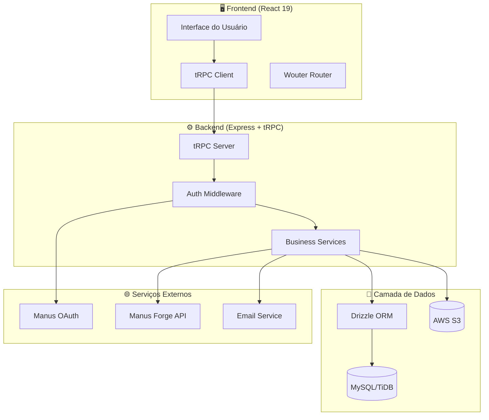

---

## 2. Fluxo de Autenticação OAuth

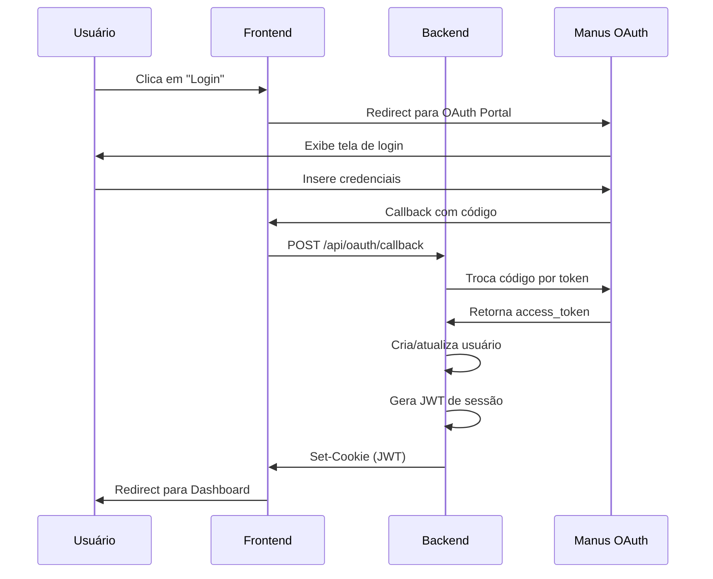

---

## 3. Estrutura de Módulos

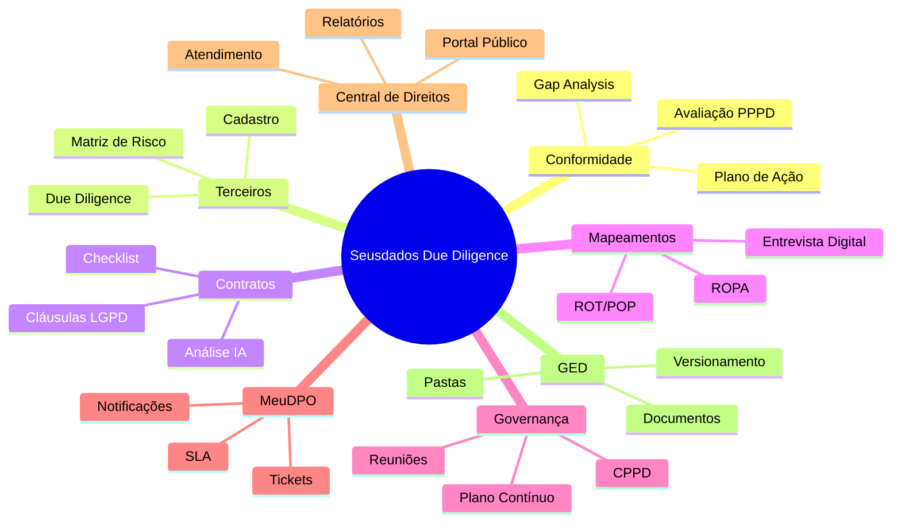

---

## 4. Fluxo de Avaliação de Conformidade

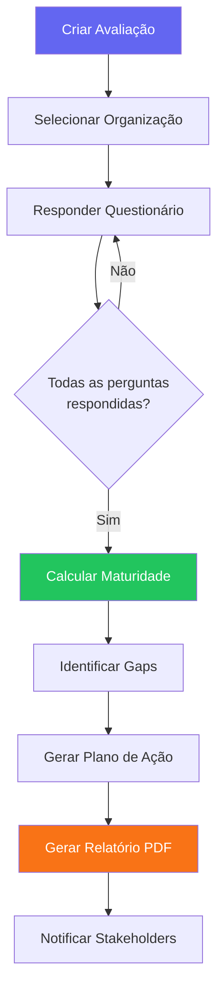

---

## 5. Fluxo de Due Diligence de Terceiros

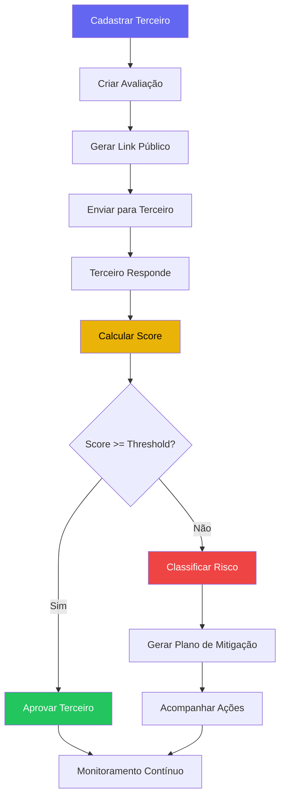

---

## 6. Fluxo de Análise de Contratos

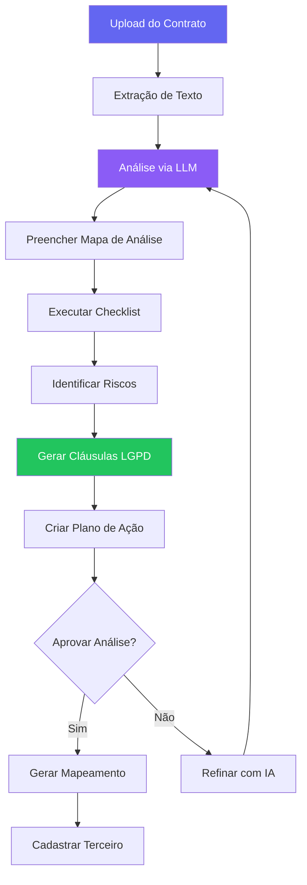

---

## 7. Fluxo de Mapeamentos (ROPA)

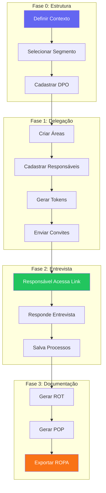

---

## 8. Fluxo de Governança PPPD

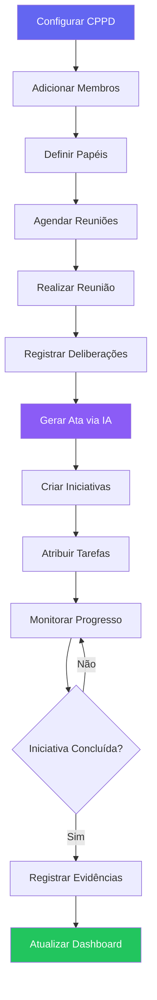

---

## 9. Fluxo de Tickets (MeuDPO)

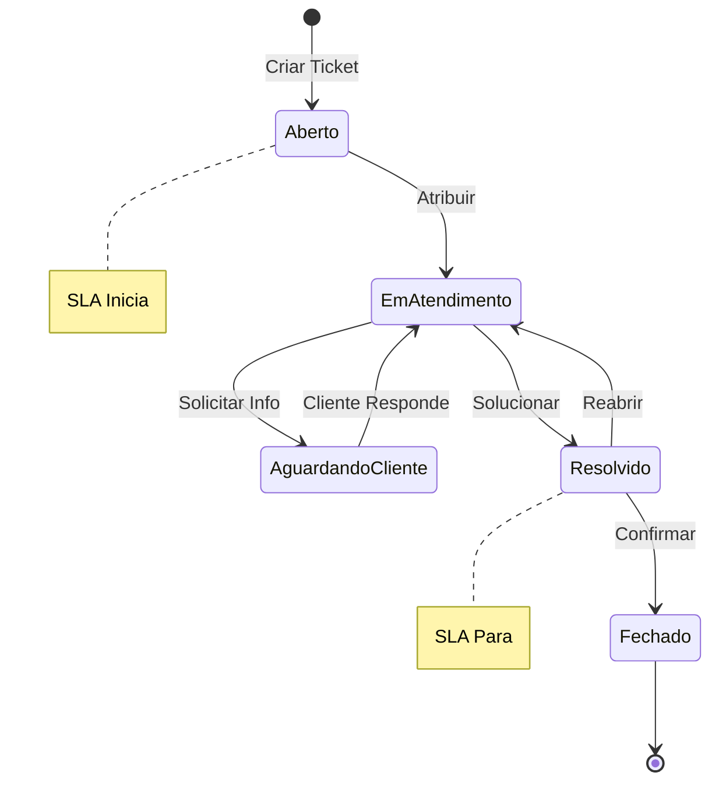

---

## 10. Fluxo de Central de Direitos

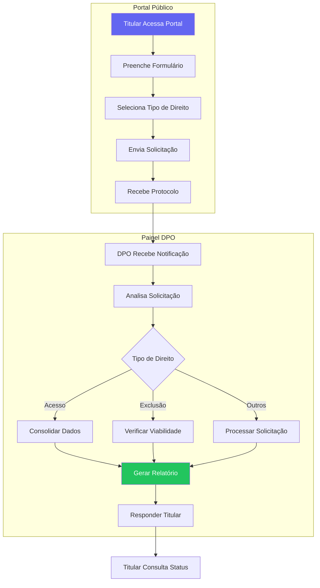

---

## 11. Integração entre Módulos

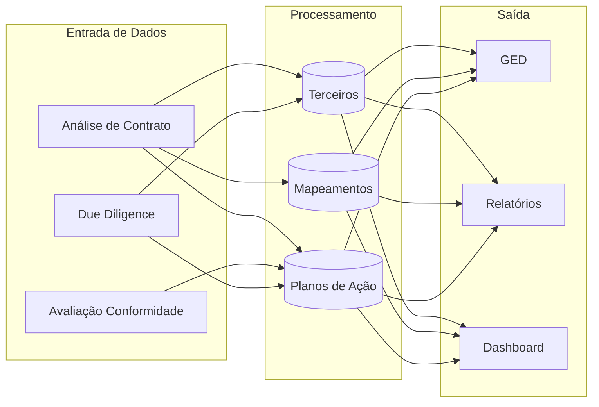

---

## 12. Modelo de Dados (ER Simplificado)

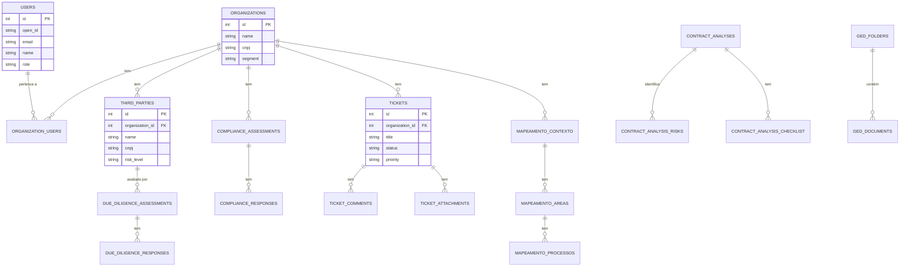

---

## 13. Arquitetura de Componentes Frontend

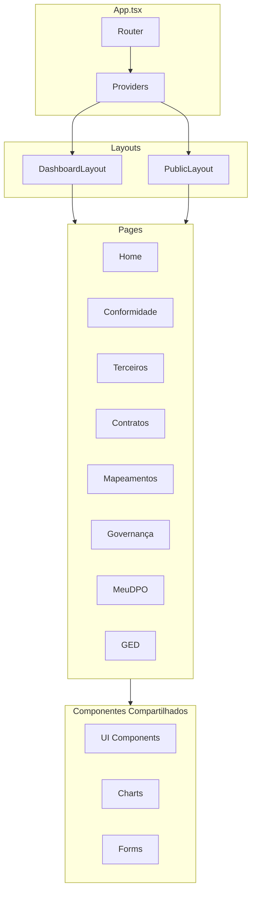

---

## 14. Pipeline de Geração de Relatórios


---

## 15. Matriz de Risco 5x5

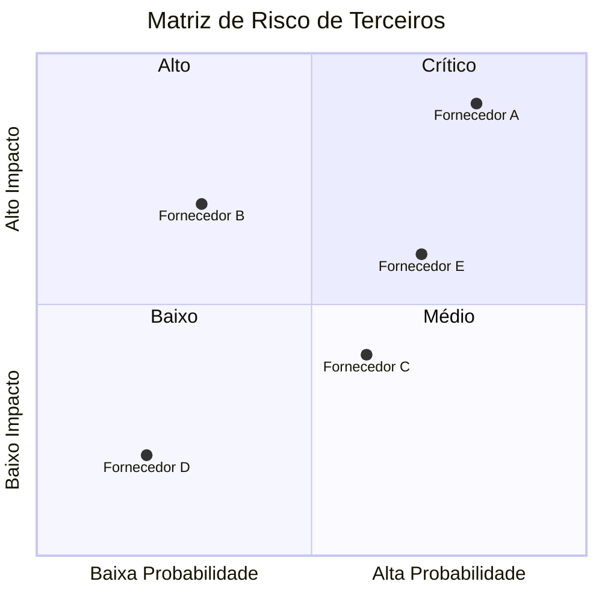

---

## 16. Ciclo de Vida de Avaliação

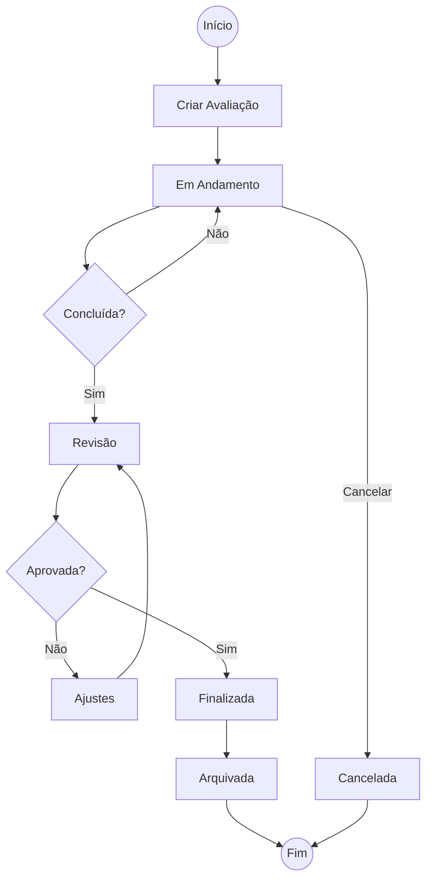

---

## Como Renderizar os Diagramas

Os diagramas acima estão em formato **Mermaid** e podem ser renderizados de várias formas:

1. **GitHub**: Suporta Mermaid nativamente em arquivos Markdown
2. **VS Code**: Extensão "Markdown Preview Mermaid Support"
3. **Online**: [Mermaid Live Editor](https://mermaid.live)
4. **CLI**: `manus-render-diagram` (disponível no sandbox)

Para gerar imagens PNG dos diagramas:

```bash
manus-render-diagram DIAGRAMAS_ARQUITETURA.md output/
```

---

**Voltar para**: [Índice da Documentação](./INDICE_DOCUMENTACAO.md)
